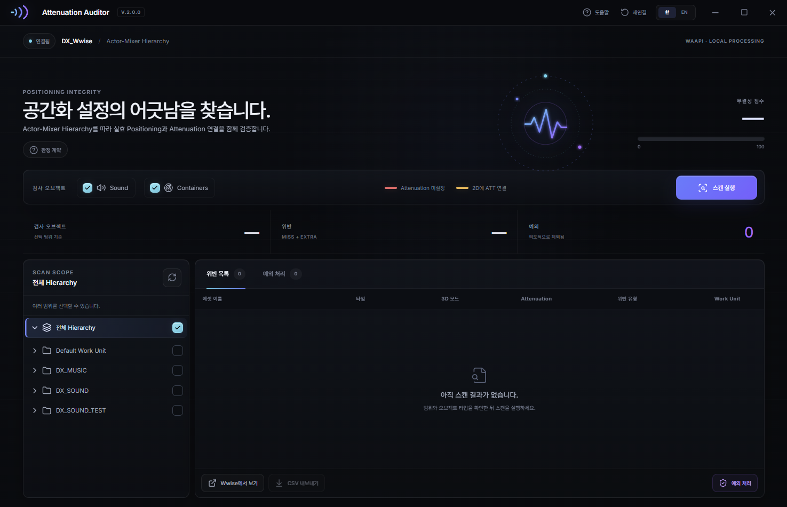
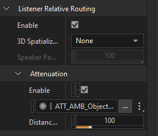

# Attenuation Auditor — Wwise

  

Wwise 프로젝트의 **Actor-Mixer Hierarchy** 를 WAAPI 로 스캔하여,
**3D 사운드인데 Attenuation 이 없는 경우** 와 **2D 사운드인데 Attenuation 이 연결된 경우** 를
한 번에 찾아주는 Windows 데스크톱 툴입니다. V2는 Stereo Auditor와 같은 제품군 품질을 목표로
**Tauri + React** UI와 독립 Python WAAPI 백엔드로 전면 재구축했습니다.

대규모 프로젝트에서 포지셔닝 / 어테뉴에이션 설정의 일관성을 유지하고
"가까이서 들려야 하는데 어디서든 풀볼륨으로 들린다", "2D 인데 거리 감쇠가 걸려 있다" 같은
잠재적 사고를 예방합니다.

<p align="center">
  
</p>

---

## 목차

- [주요 기능](#주요-기능)
- [요구 사항](#요구-사항)
- [설치](#설치)
- [실행 방법](#실행-방법)
- [사용 방법](#사용-방법)
- [스캔 판정 규칙](#스캔-판정-규칙)
- [컬럼 설명](#컬럼-설명)
- [예외 처리](#예외-처리)
- [주의 사항](#주의-사항)
- [트러블슈팅](#트러블슈팅)

---

## 주요 기능

- **3D / 2D 양방향 위반을 한 번에 탐지** (위반 색상으로 종류 구분 표시)
- **고해상도 네이티브 렌더링** — Windows Per-Monitor V2 DPI에 맞춰 선명하게 렌더되는 WebView2/Tauri UI
- **제품군 타이포그래피** — Inter Variable과 Windows DPI 힌팅 한국어 폰트 스택 적용
- **상태 기반 모션** — 스캔/완료/오류를 나타내는 Attenuation 궤도 애니메이션과 전환 효과
- **상속(Override) 인지 판정** — `Override Positioning` 이 체크된 가장 가까운 조상의 값을 기준으로 평가
- **스캔 범위 트리** — Actor-Mixer Hierarchy 의 임의 노드(들) 선택 후 부분 스캔 가능
- **대형 프로젝트 스캔 최적화** — WAQL 서버 필터링으로 선택 범위의 Sound/Container만 조회
- **타입 필터** — Sound / Container 별로 on/off
- **위반 더블클릭 → Wwise Project Explorer 자동 선택** (FindInProjectExplorer)
- **CSV 내보내기** (UTF-8 BOM, Excel 호환)
- **예외 처리** — 의도된 설정은 영구 예외로 등록 (`att_auditor_exceptions.json`)
  - 이후 설정이 바뀌면 자동으로 예외 해제 → 위반 목록에 다시 노출
- **한 / 영 토글**
- **다중 선택 일괄 예외 등록 / 해제**

---

## 요구 사항

- **Wwise 2022.1 이상** (WAAPI 활성화 필요)
  - Wwise: `User Preferences → Enable Wwise Authoring API` 체크
  - 기본 포트: `ws://127.0.0.1:8080/waapi`
- **Windows 10/11 x64** 및 Microsoft Edge WebView2 Runtime
- 설치본 사용 시 Python / Node.js / Rust는 필요하지 않습니다.
- 소스에서 다시 빌드할 때만 Python 3.10+, Node.js, Rust가 필요합니다.

---

## 설치

1. `releases\Attenuation Auditor_2.0.0_x64-setup.exe` 실행
2. Wwise에서 `User Preferences → Enable Wwise Authoring API` 활성화
3. 선택 사항: `install_addon.bat`을 실행해 Wwise Tools 메뉴에 등록

저장소에서 설치하려면 `install.bat`을 실행해도 됩니다. `install.bat`은 `releases`에 포함된
최신 설치본을 우선 사용하고, 설치본이 없으면 `build_v2.bat`이 Python 백엔드 패키징,
React 빌드, Tauri/NSIS 빌드를 순서대로 수행합니다.

`install_addon.bat` 은 `%APPDATA%\Audiokinetic\Wwise\Add-ons\Commands\AttenuationAuditor.json` 을
생성하여 Wwise 의 **Tools > Attenuation Auditor** 메뉴 항목을 추가합니다.
- 이미 Wwise 가 실행 중이면 **Tools > Reload Command Add-ons** 로 즉시 반영됩니다.

---

## 실행 방법

### 방법 1 — 설치된 앱 실행 (권장)

시작 메뉴에서 **Attenuation Auditor**를 실행합니다.

### 방법 2 — Wwise 메뉴에서 실행

`install_addon.bat` 을 1 회 실행한 뒤 Wwise 의 **Tools > Attenuation Auditor** 클릭.

### 방법 3 — 저장소에서 직접 실행
```bat
launch.bat
```

`launch.bat`은 설치된 V2 앱을 우선 실행하고, 없으면 로컬 릴리스 빌드를 실행합니다.

---

## 사용 방법

1. **Wwise 를 먼저 실행** 한 뒤 툴을 켭니다. 상단 상태가 `연결됨`으로 바뀌면 준비 완료입니다.
2. (선택) **좌측 스코프 트리** 에서 스캔 범위를 선택합니다.
   - 아무것도 선택하지 않거나 루트만 선택하면 **전체** 가 대상입니다.
   - 우측 체크 버튼으로 여러 범위를 동시에 선택할 수 있습니다.
3. **오브젝트 타입** 패널에서 검사할 타입을 켜고 끕니다.
   - `Sound` / `Containers (ActorMixer / Random / Blend / Switch)` (둘 다 기본 ON)
4. 상단 **스캔 실행** 버튼 클릭.
5. **위반 목록** 탭에서 결과 확인.
   - 행 더블클릭 → Wwise Project Explorer 에서 자동 선택
   - 다중 선택 → **+ 예외 처리** 로 의도된 설정 일괄 등록
   - **↓ CSV 내보내기** 로 외부 공유용 시트 추출

---

## 스캔 판정 규칙

### 어떤 항목을 보는가?

Wwise Property Editor 의 아래 4 개 설정을 검사합니다.
판정은 **`Override Positioning` 이 체크된 가장 가까운 조상(자신 포함)의 값** 을 기준으로 합니다.

<p align="center">
  
</p>

| # | Wwise 항목 |
|---|---|
| ① | **Listener Relative Routing → Enable** (체크박스) |
| ② | **Listener Relative Routing → 3D Spatialization** (`None` / `Position` / `Position + Orientation`) |
| ③ | **Attenuation → Enable** (체크박스) |
| ④ | **Attenuation → ShareSet** (예: `ATT_AMB_Object...` 같은 프리셋 연결 여부) |

### 핵심 규칙

> **네 가지가 모두 설정되어 있다 → `정상 3D` ✓**
> **네 가지가 모두 없다 → `정상 2D` ✓**
>
> 두 그룹 ( ①② Positioning · ③④ Attenuation ) 의 상태가 **서로 어긋나면 위반** 입니다.

### 그룹 정의

| 그룹 상태 | 정의 |
|---|---|
| **3D 의도**       | ① **Enable = ON** **AND** ② **3D Spatialization = Position** 또는 **Position + Orientation** |
| **2D 의도**       | 위 조건 미충족 (① 가 꺼져 있거나, ② 가 `None`) |
| **ATT 활성**      | ③ **Enable = ON** **AND** ④ **ShareSet 설정됨** |
| **ATT 비활성**    | 위 조건 미충족 (③ 가 꺼져 있거나, ④ 가 비어 있음) |

### 핵심 매트릭스 (2 × 2)

|                | **ATT 활성**     | **ATT 비활성**   |
|----------------|------------------|------------------|
| **3D 의도**    | ✓ 정상           | ❌ **위반**      |
| **2D 의도**    | ❌ **위반**      | ✓ 정상           |

### 전체 16 경우의 수

| # | ① LRR Enable | ② 3D Spatialization | ③ ATT Enable | ④ ATT ShareSet | 판정 |
|---|:--:|:--:|:--:|:--:|:--|
| 1 | ✅ | Position(+Ori) | ✅ | ✅ | ✓ 정상 |
| 2 | ✅ | Position(+Ori) | ✅ | ❌ | ❌ 위반 |
| 3 | ✅ | Position(+Ori) | ❌ | ✅ | ❌ 위반 |
| 4 | ✅ | Position(+Ori) | ❌ | ❌ | ❌ 위반 |
| 5 | ✅ | None           | ✅ | ✅ | ❌ 위반 |
| 6 | ✅ | None           | ✅ | ❌ | ✓ 정상 |
| 7 | ✅ | None           | ❌ | ✅ | ✓ 정상 |
| 8 | ✅ | None           | ❌ | ❌ | ✓ 정상 |
| 9 | ❌ | Position(+Ori) | ✅ | ✅ | ❌ 위반 |
| 10| ❌ | Position(+Ori) | ✅ | ❌ | ✓ 정상 |
| 11| ❌ | Position(+Ori) | ❌ | ✅ | ✓ 정상 |
| 12| ❌ | Position(+Ori) | ❌ | ❌ | ✓ 정상 |
| 13| ❌ | None           | ✅ | ✅ | ❌ 위반 |
| 14| ❌ | None           | ✅ | ❌ | ✓ 정상 |
| 15| ❌ | None           | ❌ | ✅ | ✓ 정상 |
| 16| ❌ | None           | ❌ | ❌ | ✓ 정상 |

### 보조 메모

- **`3D Spatialization = None` 은 LRR Enable 이 켜져 있어도 거리 감쇠가 적용되지 않습니다.** 그래서 2D 의도로 분류 (케이스 5–8).
- **Attenuation Enable 이 꺼져 있으면 ShareSet 이 연결돼 있어도 런타임에는 적용되지 않습니다.** 그래서 ATT 비활성으로 분류 (케이스 7, 11, 15).
- ShareSet 이 null GUID 인 케이스 (`{00000000-...}`) 는 자동으로 미설정 처리됩니다.
- 조상까지 올라가도 `Override Positioning` 이 체크된 노드가 없으면 → "기본 2D / 무 ATT" 로 간주하고 **스킵** 합니다.

---

## 컬럼 설명

| 컬럼          | 의미 |
|---------------|------|
| **Name**      | 위반 오브젝트 이름 |
| **Type**      | `Sound` / `ActorMixer` / `RandomSequenceContainer` / `BlendContainer` / `SwitchContainer` |
| **3D Spatialization** | `None` / `Position` / `Position + Orientation` (effective 값) |
| **Attenuation** | ShareSet 이름. Enable=off 이면 `(disabled)` 표시 |
| **Issue**     | 위반 종류 표시 |
| **Work Unit** | 소속 워크유닛 이름 |
| **Path**      | Wwise 내 경로 |

> 위반 종류는 배지와 색으로 함께 표시됩니다 (🔴 빨강 / 🟡 노랑).

---

## 예외 처리

- 의도적으로 위반으로 잡힌 항목은 `+ 예외 처리` 로 등록 → **예외 처리** 탭에서 관리.
- 예외는 `att_auditor_exceptions.json` 에 영구 저장됩니다.
- 자동 무효화: 이후 해당 객체의 `(3D Spatialization, Attenuation, 위반 종류)` 가 바뀌면
  예외가 자동 해제되고 위반 목록에 다시 노출됩니다.
- 예외 항목도 더블클릭 → Wwise Project Explorer 에서 선택 가능.

---


## 트러블슈팅

| 증상 | 원인 / 해결 |
|------|------------|
| 백엔드 시작 실패 | 설치본을 다시 설치하거나 소스 환경에서는 `build_v2.bat` 재실행 |
| `연결 실패  —  WAAPI 활성화 필요` | Wwise 의 User Preferences 에서 WAAPI 체크 후 재시작 |
| 더블클릭해도 Wwise 에서 안 보임 | `FindInProjectExplorer` 명령이 없는 구버전 Wwise. 수동으로 Path 검색 |
| 의도된 패턴이 위반으로 잡힘 | `+ 예외 처리` 로 등록 |
